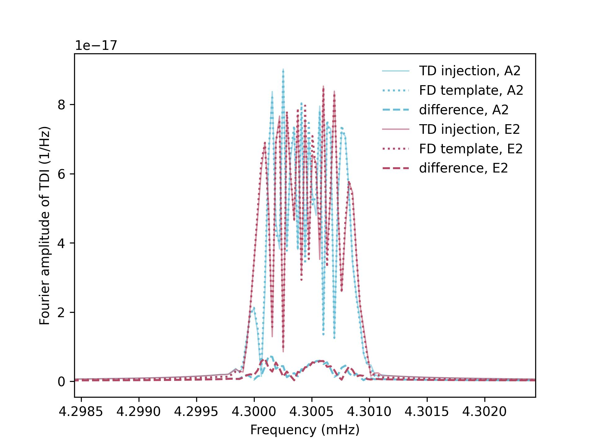

# Triangle-GB
Frequency-domain GB TDI-2.0 response, modified from GBGPU (the GPU implementation of FastGB algorithm) to support the numerical orbit of Taiji and TDI-2.0. 
The responses are consistent with the time-domain simulations of **Triangle-Simulator**. 
The code also offers as an illustrative example for the preliminary analysis of **Taiji Data Challenge**, and should not be regarded as a solution to all the challenges.

# Installation 
1. install [Triangle-Simulator](https://github.com/TriangleDataCenter/Triangle-Simulator) 

2. install modified gbgpu:

on linux:  
```sh
  cd GBGPU_numorbit
  conda install -c conda-forge gcc_linux-64 gxx_linux-64 gsl Cython
```
to get GPU support, install cupy by pip (replace 92 by your own cuda toolkit version): 
```sh
  pip install cupy-cuda92
```
install package from source:
```sh
  python setup.py install
```

on macos (arm chip):
replace gcc_linux-64 gxx_linux-64 by 
```sh
  clang_osx-arm64 clangxx_osx-arm64
```

3. install MCMC tools to run the tutorial:
```sh
  pip install eryn corner
```

# Comparison with time-domain simulation 


# References 
- Taiji Data Challenge \& Triangle: [the TDC \& Triangle paper](TBD)
- The fast frequency-domain detector response of galactic binaries: [N. J. Cornish et al, Phys.Rev.D76:083006,2007](https://doi.org/10.1103/PhysRevD.76.083006)
- GBGPU: [GBGPU documentations](https://mikekatz04.github.io/GBGPU/html/index.html)

