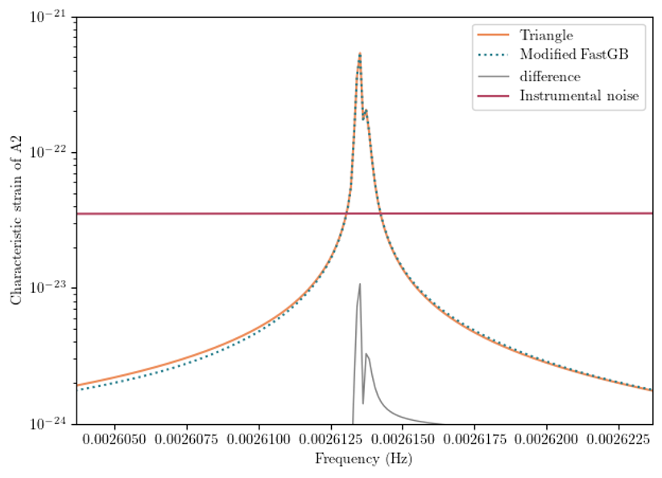

# Triangle-GB
Frequency-domain GB TDI response, modified from GBGPU (https://github.com/mikekatz04/GBGPU) to support numerical orbits and 2nd-generation TDI. 

# Installation 
1. install triangle 

2. install modified gbgpu:

on linux:   
1) cd GBGPU_numorbit
2) conda install -c conda-forge gcc_linux-64 gxx_linux-64 gsl Cython 
3) to get GPU support, install cupy by pip: pip install cupy-cuda92 (replace 92 by your own cuda toolkit version)
4) python setup.py install

on macos (arm chip):
replace gcc_linux-64 gxx_linux-64 by clang_osx-arm64 clangxx_osx-arm64 

3. install MCMC tools to run the tutorial: 
pip install eryn corner 

# Comparison with time-domain simulation 

